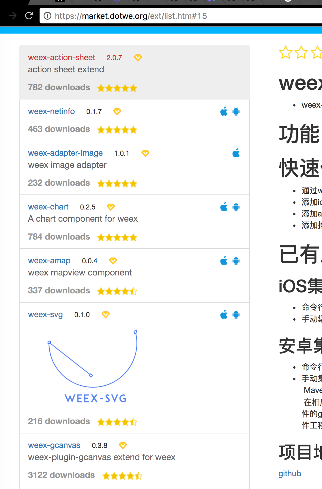
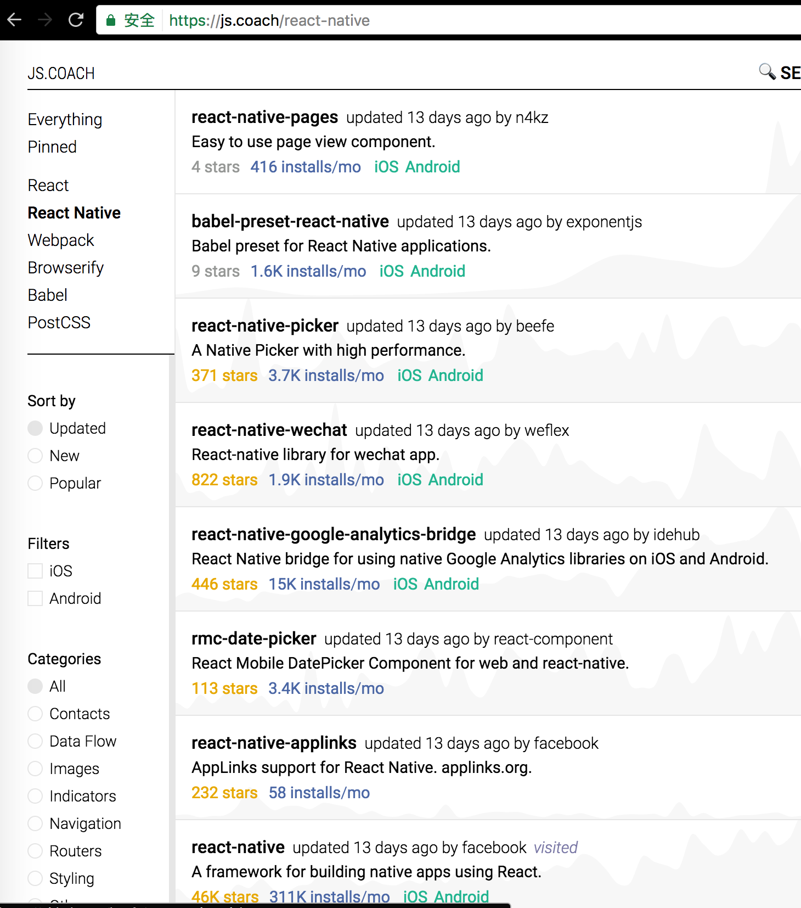
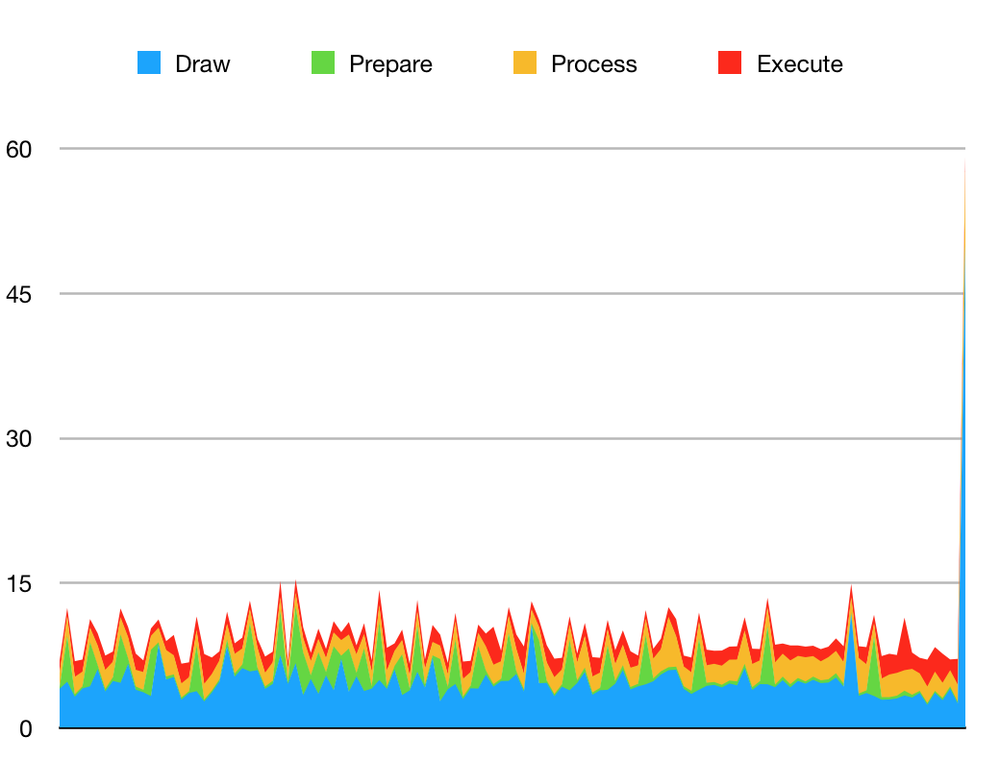
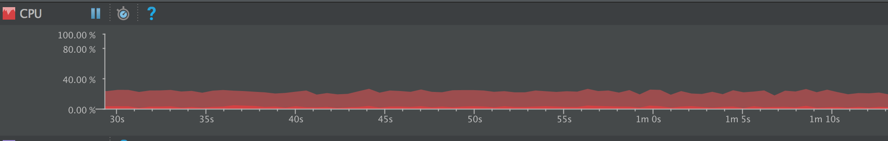

# weex vs RN

文档版本0.0.1<br>
说明: Weex 和 React Native 是使用js开发移动端的两大热门框架，Weex 是阿里巴巴旗下的，React Native 是facebook旗下的。二者现在均开源，以下内容主要介绍了二者的优劣，可从官网中了解两大技术。[Weex](http://weex.apache.org/cn/guide/)， [React Native](https://facebook.github.io/react-native/docs/getting-started.html)

## 对比
### 1、跨平台
Weex：Weex官网宣称是跨三端，确实绝大部分组件做到了跨三端，应该封装绝大部分易于抽象的，能够三端实现的组件，但是各个平台在这些组件上还是会略有差异，有些平台特定的组件或者样式Weex并没有进行[封装](http://weex.apache.org/cn/references/web-standards.html)

React Native: 跨两端，也是封装了native组件，对于特定平台有特定的组件，但是并不能运行在Web端，社区中有人尝试过做一层封装跑到web上，但反馈并不好。

总结：二者皆对于平台绝大部分组件进行了封装，例如image/text等，但是RN在ios和android端自带组件多一些，二者开发过程中还是可能需要对特定平台的进行判断，或者编写特定平台的代码用以封装，Weex的优势在于天生集成web端。

```
Weex: 4
React Native: 3.5

```
### 2、版本要求
Weex: 支持安卓4.0+，ios7.0+

React Native: 支持安卓4.1+, ios7.0+

总结: 版本要求Weex略胜一筹，大巴但是安卓4.0以下用户，ios7.0以下用户的数量级已经很小，对整体的用户体验不大，当然多一个版本就是多一些赚钱的机会！

```
Weex: 5
React Native: 4.5

```
### 3、学习成本
Weex: 使用Vue作为上层框架，语法简单，易于上手

React Native: 使用jsx语法，相对于Vue语法（当然Vue也支持jsx）复杂一些。

总结: 排除对组件的使用，只谈语法，Vue语法明显更符合当今前端开发方式，jsx超前一些，适用于重逻辑的业务，当然，jsx熟悉之后，也非常方便。

```
Weex: 5
React Native: 4

```

### 4、社区贡献

Weex: 官方平台上，目前来看只有十个可用组件[market](https://market.dotwe.org/ext/list.htm#15),电商常用的支付模块也没有相应的社区贡献，如果没有这类组件，前端需要自己编写原生代码（OC，java）

React Native: 社区贡献度非常活跃，这一点RN完胜Weex，[module](https://js.coach/react-native)，这点节约了业务开发很多时间和精力。

总结: React Native社区基本上做到了覆盖了所有的业务组件，这一点Weex社区需要做的还有很多

```
Weex: 1
React Native: 5

```

### 5、调试

Weex: Weex Devtools，可同时检查weex里DOM属性和Javascript 代码断点调试，支持IOS和Android两个平台。

React Native: React Developer Tools,可同时检查weex里DOM属性和Javascript 代码断点调试, 并且可以调试redux，查看数据流。

总结: 二者均有很出色的调试工具

```
Weex: 5
React Native: 5

```
### 6、打包

Weex: Weex默认打的JS bundle只包含业务JS代码，体积小很多，基础JS库包含在Weex SDK中。

React Native: 官方只允许将React Native基础JS库和业务JS一起打成一个JS bundle，没有提供分包的功能，所以如果想节约流量就必须制作分包打包工具.

总结: Weex更加轻量，体积小巧。

```
Weex: 5
React Native: 3

```
### 7、性能

```
使用SM-A9000，安卓版本5.1.1测试
```

Weex: 

React Native: 在React Native跑ScrollView,500条模拟数据，item高度有变化，部分item插入图片，使用安卓自带GPU呈现模式分析(Profile GPU rendering)，在开启这个功能后，系统就会记录保留每个界面最后128帧图像绘制的相关时间信息，测得结果如图所示:

Draw + Process + Execute = 完整显示一帧 ，这个时间要小于16ms才能保存每秒60帧。从图中可以看出，基本上维持在16ms以下。具体分析方法[GPU呈现模式分析](http://www.cnblogs.com/myzh/archive/2013/03/17/2965225.html)

CPU占用率：通过Android Studio 检测可以看到，cpu占用率一直在20%左右徘徊。，最大可达24%，最低在13%左右。

总结: 

```
Weex: 5
React Native: 3

```



